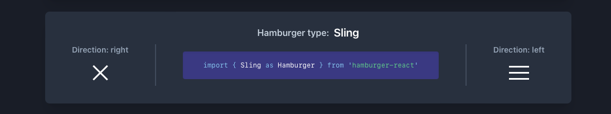
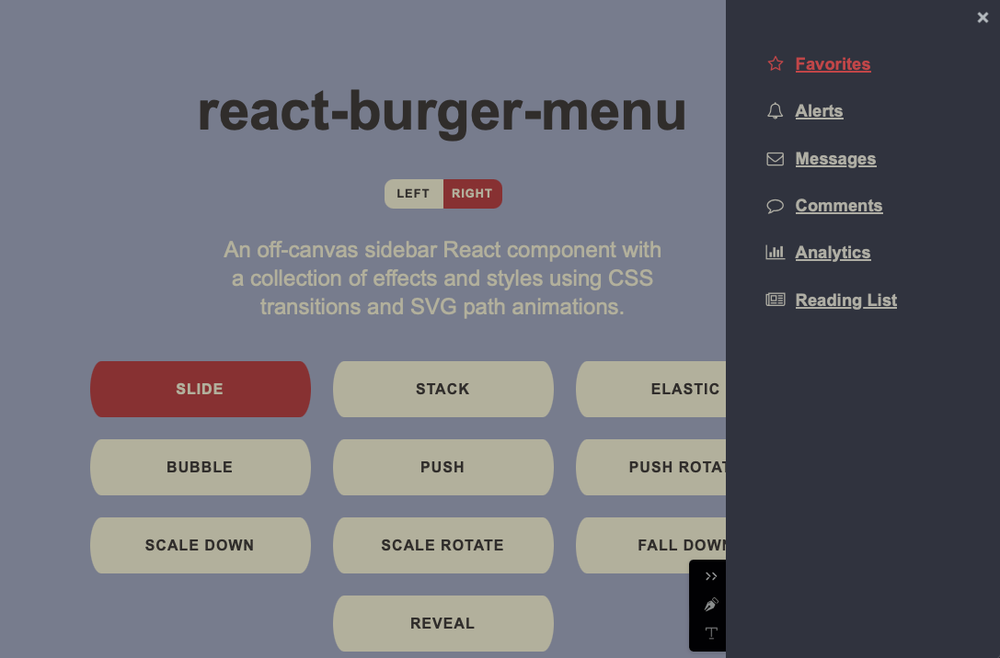

# React + TypeScript + Vite

Demo: https://creative-e-commerce-tk7x.vercel.app/#

```js

```

## Useful resources

- icons8.com

## Hamburger-React Animated Hamburger Icon



- [Hamburger-React Official Website](https://hamburger-react.netlify.app/)
- Install with `npm install hamburger-react`
- Import using `import { Sling as Hamburger } from "hamburger-react";`
- Properties & examples
  size={} duration={0.8} distance="lg" color="#4FD1C5" easing="ease-in" rounded label="Show menu" hideOutline={false}

## React-Burger-Menu (Hamburger) NavBar



- [React-Burger-Menu on npm](https://www.npmjs.com/package/@katasonovyp/react-burger-menu)
- Install with `npm install react-burger-menu --save`
- Import using `import { slide as Menu } from 'react-burger-menu'`

For detailed properties and usage, refer to the link above.

## Gallery - Material Tailwind

- https://www.material-tailwind.com/docs/react/gallery
- npm i @material-tailwind/react
- TailwindCSS Configurations (see on webpage)

## Card

- https://flowbite.com/docs/components/card/
- E-commerce card #

## accordion (mobile)

- npm install @heroicons/react (for arrows)

## Footer

- https://medium.com/@ryaddev/building-react-footer-components-with-tailwindcss-6f2c5909a9d1
- npm install react-icons
- responsive

## React image Zoom ( image picker: )

- npm i react-image-zoom
- https://mario-duarte.github.io/react-image-zooom/
